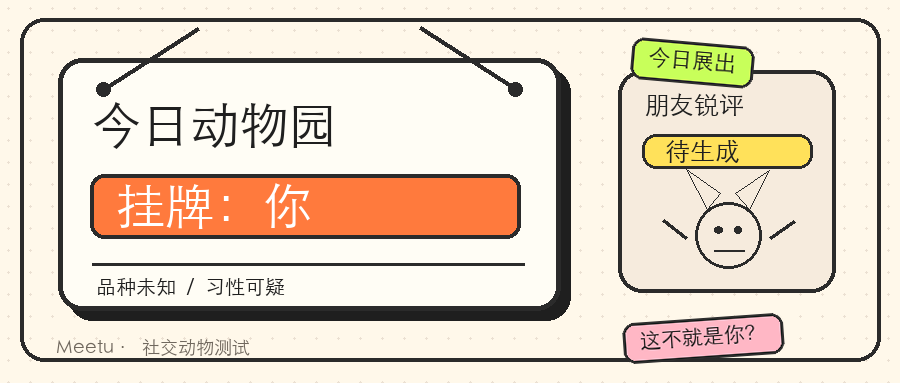
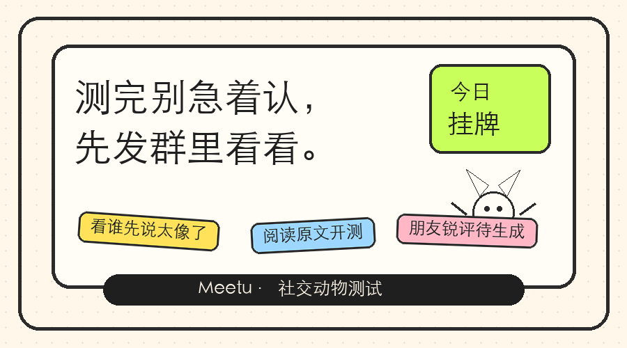

# 微信公众号首篇文章排版视觉 Spec v1

## 任务定位

这份 spec 服务公众号文章的代码化实现，不是再做单张海报。目标是在微信文章里建立统一的“今日动物园挂牌：你”视觉世界，让正文像一份社交动物挂牌档案，而不是普通推文。

视觉关键词：

- 桌面便签动物园
- 动物园挂牌 / 今日展出
- 朋友锐评待生成
- 暖纸底、黑线、便签、档案行、轻微歪斜
- 短、损、有梗，但不审判用户

## 当前图片资产口径

### 继续使用

- 头图：`微信公众号首篇-头图-v2.png`（900×383）
- 文末 CTA 图：`微信公众号首篇-文末CTA-v2.png`（900×500）

这两张图已和文章标题「今日动物园挂牌：你」一致，可以作为 v1 视觉基准。

### 不新增生产图片

文章内如果需要额外插图，优先用 HTML/CSS 卡片完成。若必须使用生图，只交 GPT Image 2 prompt 做无字底图，中文必须手工排版。

## 公众号环境约束

- 移动端 375 宽优先；
- 代码尽量 inline CSS 友好；
- 不依赖 JS / 动效 / 外链字体；
- 避免复杂定位，正文信息都进正常文档流；
- 图片宽度 `100%`，最大宽度按公众号正文容器自动适配；
- 段落行高要大，避免小字密集导致阅读疲劳。

## 基础 Token

```css
--paper: #FFF8EA;
--paper-card: #FFFDF5;
--paper-deep: #F6EBDD;
--ink: #1F1F1F;
--line: #2B2B2B;
--muted: #70685E;
--orange: #FF7A3D;
--green: #C8FF5A;
--yellow: #FFE15A;
--pink: #FFB7C5;
--blue: #9DD7FF;
--radius-card: 22px;
--radius-note: 14px;
--stroke: 2px solid #2B2B2B;
```

公众号内无法使用 CSS variables 时，直接写对应 hex。

## 文章整体容器

建议文章主体用一个暖纸底容器包裹，但不要强行全屏背景；在公众号编辑器里可以对每个模块单独加卡片样式。

```html
<section style="margin:0 auto;padding:8px 0 24px;color:#1F1F1F;font-family:-apple-system,BlinkMacSystemFont,'PingFang SC','Noto Sans SC','Microsoft YaHei',sans-serif;font-size:16px;line-height:1.78;">
  ...
</section>
```

## 组件 1：动物园挂牌段落

用途：文章开头第一段，承接标题。把“你被挂牌了”的设定立住。

适合放文案：

```text
今日动物园挂牌：你。
品种未知，习性可疑，朋友锐评待生成。
```

HTML 结构建议：

```html
<section style="margin:18px 0;padding:18px 16px;border:2px solid #2B2B2B;border-radius:22px;background:#FFFDF5;box-shadow:5px 5px 0 rgba(31,31,31,.12);">
  <div style="display:inline-block;margin-bottom:12px;padding:4px 10px;border:2px solid #2B2B2B;border-radius:999px;background:#C8FF5A;font-size:13px;font-weight:900;transform:rotate(-2deg);">今日展出</div>
  <p style="margin:0 0 10px;font-size:26px;line-height:1.22;font-weight:900;letter-spacing:-.5px;">今日动物园挂牌：你</p>
  <div style="margin-top:12px;padding-top:12px;border-top:2px solid #2B2B2B;font-size:15px;font-weight:700;color:#1F1F1F;">
    品种：未知<br />
    习性：可疑<br />
    朋友锐评：已生成
  </div>
</section>
```

## 组件 2：正文普通段落

用途：承载 Lucy 正文，不要每段都做卡片，否则像产品说明书。普通段落保持松散、短句、留白。

```html
<p style="margin:18px 0;color:#1F1F1F;font-size:16px;line-height:1.82;font-weight:500;">
  正文段落内容。
</p>
```

建议每段 1–3 行，不要长段。

## 组件 3：便签吐槽卡

用途：插入测试同源梗，例如“出门启动失败”“脑内弹幕加载中”。数量控制在 2–3 个，不能堆满。

```html
<section style="margin:20px 0;padding:14px 14px;border:2px solid #2B2B2B;border-radius:16px;background:#FFE15A;box-shadow:4px 4px 0 rgba(31,31,31,.14);transform:rotate(-1deg);">
  <p style="margin:0;font-size:18px;line-height:1.5;font-weight:900;">出门启动失败本人。</p>
</section>
```

可替换背景：`#C8FF5A` / `#FFB7C5` / `#9DD7FF`。每篇不要超过 3 色。

## 组件 4：朋友锐评框

用途：文章中段最适合放“朋友视角”的句子，模拟 H5 结果页的朋友锐评模块。

```html
<section style="margin:22px 0;padding:16px 16px;border:2px dashed #2B2B2B;border-radius:18px;background:#FFFFFF;">
  <div style="margin-bottom:8px;color:#70685E;font-size:12px;font-weight:900;letter-spacing:.12em;">朋友锐评</div>
  <p style="margin:0;font-size:17px;line-height:1.65;font-weight:800;color:#1F1F1F;">不像测试，像群友合谋写的挂牌说明。</p>
</section>
```

## 组件 5：阅读原文 CTA 卡

用途：文章结尾，配合文末 CTA 图。不要写“立即测试/快来下载”，保持轻。

```html
<section style="margin:24px 0 12px;padding:18px 16px;border:2px solid #2B2B2B;border-radius:22px;background:#FFFDF5;box-shadow:5px 5px 0 rgba(31,31,31,.12);">
  <p style="margin:0 0 12px;font-size:22px;line-height:1.35;font-weight:900;">测完别急着认，先发群里看看。</p>
  <p style="margin:0;color:#70685E;font-size:14px;line-height:1.65;font-weight:700;">阅读原文，看看今天挂的是哪只你。</p>
</section>
```

## 图片使用规范

### 头图

```html

```

### 文末 CTA 图

```html

```

公众号图不建议再加外层阴影，图片内部已有边框和纸感。

## GPT Image 2 Prompt（可选补充无字内页插图）

```text
Create a no-text inline illustration for a WeChat Official Account article, horizontal 16:9 PNG.

Theme: a Chinese college social animal test, “zoo placard / today on display” metaphor. The image should be a warm paper desk scene with a blank zoo exhibit tag, a small weird anti-cute social animal silhouette, sticky notes, doodle arrows, and friend-roast stamp shapes.

Style: desktop sticky-note animal-test, rough black line art, warm paper, adult college meme tone, slightly absurd, not cute, not childish.

Hard constraints: NO Chinese text, NO English text, NO fake writing, NO numbers, NO QR code, NO app CTA, NO 16 animals, NO H5 screenshot, NO cute/kawaii/pet sticker style. All readable copy will be manually typeset in the article.

Palette: #FFF8EA, #FFFDF5, #2B2B2B, #FF7A3D, #C8FF5A, #FFE15A, #FFB7C5, #9DD7FF.
```

## 排版节奏建议

建议文章顺序：

1. 头图 v2；
2. 普通短段：开场发疯/挂牌设定；
3. 动物园挂牌段落；
4. 普通短段：测试只问朋友局小场景；
5. 便签吐槽卡 1–2 个；
6. 朋友锐评框；
7. 普通短段：别急着认，发群里；
8. 文末 CTA 图 v2；
9. 阅读原文 CTA 卡。

## 验收清单

- [ ] 第一屏能看见头图和“今日动物园挂牌：你”世界观；
- [ ] 正文不是每段都卡片化，阅读不累；
- [ ] 便签/锐评框用于制造节奏，不堆装饰；
- [ ] 所有中文都手工排版，未使用 AI 生成中文作为生产文本；
- [ ] 375 宽可读，正文不小于 15–16px；
- [ ] 没有二维码、下载、报名、进群、大 logo；
- [ ] 文章视觉服务公众号阅读，不是小红书封面堆法。
